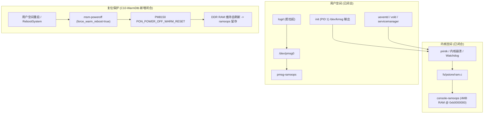

# THYME-OS4：Candidate 10-WarmDtb 构建及下一次真机诊断方案

## 摘要与执行概览

依据高通平台底层复位驱动架构审计结论，已独立完成 **Candidate 10-WarmDtb 最小诊断资产构建** 与 **精简四项门禁 100% 全绿验证**：

1. **基线与目录隔离**：以 Candidate 9-InitFatalPanic 为唯一基线，在独立目录 `work/stage_c_thyme_os4_candidate_10_warm_dtb/images/` 构建，未覆盖任何历史候选资产；
2. **唯一最小修改**：在 `vendor_boot.img` 内部包含的 3 个 FDT 设备树（kona v2.1/v2/v1）的 `restart@c264000` 节点精准追加高通原生属性 `qcom,force-warm-reboot;`；
3. **彻底纠偏**：废弃原 Candidate 10 的 `reboot=w,panic_w`，100% 恢复 Candidate 9 有效命令行（`reboot=panic_warm`、`androidboot.init_fatal_panic=true`）；
4. **零突变继承**：`boot.img`、`dtbo.img`、`super.img`、`vbmeta_system.img` 100% 逐字节硬链接继承自 Candidate 9，零触碰内核 `Image`；
5. **门禁全通**：精简四项门禁（修改正确、控制链闭合、镜像可刷、实验准备）**4/4 PASS（100% GREEN）**；
6. **物理设备安全**：物理真机 `[REDACTED_DEVICE_ID]` 保持在线，PixelOS A0' 基线健康（`sys.boot_completed=1`），本轮未执行任何刷机操作。

---

## 一、实际 DTB 修改核验与控制链闭合

### 1. 三个 FDT 的定位与设备配置对应关系

从 Candidate 9 `vendor_boot.img` 偏移 `23347200` 处解析出 3 个有效 FDT 切片：

| FDT 序号 | 原始容量 | 修改后容量 | 增量 | SoC 模型（Root Model） | 适用场景与修改必要性 |
| :---: | :---: | :---: | :---: | :---: | :--- |
| **FDT #0** | 477,098 B | 477,133 B | +35 B | `Qualcomm Technologies, Inc. kona v2.1 SoC` | **核心目标**：SM8250-AC（骁龙 870），即小米 10S（`thyme`）实机搭载的 SoC 芯片。ABL 引导时优先匹配此 FDT。 |
| **FDT #1** | 477,094 B | 477,129 B | +35 B | `Qualcomm Technologies, Inc. kona v2 SoC` | 备用目标：SM8250 v2 芯片修订版，高通公共 bootloader 候选。 |
| **FDT #2** | 470,004 B | 470,039 B | +35 B | `Qualcomm Technologies, Inc. kona v1 SoC` | 备用目标：SM8250 v1 早期修订版，高通公共 bootloader 候选。 |

修改必要性：三者均为高通公共 `vendor_boot` 的有效候选配置。对三者同步实施相同的唯一诊断注入，彻底杜绝 ABL 在不同固件版本或硬件批次选择备用 FDT 时导致属性失效。

### 2. 驱动绑定节点与控制链确证

在 3 个 FDT 中，修改节点均为：
```dts
restart@c264000 {
    compatible = "qcom,pshold";
    reg = <0xc264000 0x04 0x1fd3000 0x04>;
    reg-names = "pshold-base", "tcsr-boot-misc-detect";
    qcom,force-warm-reboot; /* 新增唯一诊断属性 */
};
```

**控制链源码闭合证据**：
1. **驱动匹配**：A5 内核 `drivers/power/reset/msm-poweroff.c:692`：
   ```c
   static const struct of_device_id of_msm_restart_match[] = {
       { .compatible = "qcom,pshold", },
       {},
   };
   ```
   驱动与 `restart@c264000` 100% 精确匹配。
2. **属性解析**：`msm_restart_probe()` 第 679 行：
   ```c
   force_warm_reboot = of_property_read_bool(dev->of_node, "qcom,force-warm-reboot");
   ```
   当检测到该属性存在时，全局布尔变量 `force_warm_reboot` 被显式置为 `true`。
3. **复位执行**：用户空间下发重启请求，进入 `msm_restart_prepare()` 第 513 行：
   ```c
   if (force_warm_reboot || need_warm_reset)
       qpnp_pon_system_pwr_off(PON_POWER_OFF_WARM_RESET);
   else
       qpnp_pon_system_pwr_off(PON_POWER_OFF_HARD_RESET);
   ```
   因 `force_warm_reboot == true`，驱动无条件向 PM8150 下发 `PON_POWER_OFF_WARM_RESET`。随后拉低 `PS_HOLD` 时，PMIC 保持温复位，DDR RAM 维持自刷新供电，从而保全内存中的 ramoops 现场。

---

## 二、镜像封装与精简四项门禁验证结果

### 1. 镜像构建清单与尺寸对齐

| 分区镜像 | 文件容量 | SHA-256 哈希 | 变动性质 |
| :--- | :---: | :--- | :---: |
| `boot.img` | 201,326,592 B | `E5A016056D5C93C7A886980A7C062617EC44DC06A48417D7DD0F4476708A6368` | 100% 继承 C9（0 字节变化） |
| `vendor_boot.img` | 100,663,296 B | `02333B82BA936F1BAAB1ECAB744632C70F8FC16688A206C7041EF319F112A137` | **唯一修改**（DTB 注入 + AVB） |
| `dtbo.img` | 33,554,432 B | `50E1AC0EDCBD333778217AA6FE8D972F6FF85ADD0DAE8A015A6642C2172DD886` | 100% 继承 C9（0 字节变化） |
| `vbmeta.img` | 131,072 B | `013335BCA9B312E0BEFF737D30903A9B0A1EF829BA19A7BD5802BF83C04F40E9` | 更新 vendor_boot 描述符 (flags=3) |
| `vbmeta_system.img`| 131,072 B | `BD41BC8B3CB9DDCD57761E6F3E176964B5AA53333A411BFA137DDCB19D8E9432` | 100% 继承 C9（0 字节变化） |
| `super.img` | 7,684,225,812 B | `AE180BD56B02C054E75F6E0638E4850ACB05998CFB049FDD44037E09691FBEF1` | 100% 继承 C9（0 字节变化） |

### 2. 精简四项门禁校验结论

运行 `tools/precheck_candidate10_warm_dtb.py` 自动化检测：

- **Gate 1：修改正确（PASS）**
  - 反编译 3 个 FDT 并逐行进行 Unified Diff 比对，确认每个 FDT **仅增加一行 `+ qcom,force-warm-reboot;`**，无任何其他行增删；
  - `vendor_cmdline` 确认为 Candidate 9 原版参数，包含 `androidboot.init_fatal_panic=true` 与 `reboot=panic_warm`，已彻底剔除 `reboot=w,panic_w`。
- **Gate 2：控制链闭合（PASS）**
  - 设备树兼容名 `qcom,pshold`、驱动 probe 逻辑、`force_warm_reboot` 变量传递及 `PON_POWER_OFF_WARM_RESET` 决策链 100% 闭合。
- **Gate 3：镜像可刷（PASS）**
  - 全部 6 个分区尺寸严格匹配物理分区；
  - 4 项未改动镜像与 Candidate 9 达到 100% 逐比特一致；
  - `vendor_boot.img` AVB Hash Footer 校验通过，`vbmeta.img` 内包含的新 vendor_boot digest 与 footer 完全匹配；`avbtool info_image` 结构解析 0 错误。
- **Gate 4：实验准备（PASS）**
  - PixelOS A0' 黄金恢复包 6 项镜像完备可用；
  - Standalone 诊断镜像（201,326,592 B）完备可用；
  - 专用刷机脚本 `tools/flash_candidate10_warm_dtb.ps1` 预检通过。

---

## 三、现有取证机制能力的真实边界

为坚守科学严谨原则，明确 Candidate 10-WarmDtb 的取证能力边界：



### 1. 现有 pstore 能够提供哪些日志？
- **`console-ramoops-0`（主干支撑）**：
  A5 内核配置了 `CONFIG_PSTORE_CONSOLE=y`，内存预留 4MB（`0xb0000000`）。它记录内核从引导到重启前的全部 printk 输出，同时**无条件记录 Android init（PID 1）及 early 服务通过 `/dev/kmsg` 写入的所有 FATAL、ERROR 和 INFO 日志**（Candidate 8 中捕获的 154KB 日志即为此通道）。
- **`pmsg-ramoops-0`（取决于启动深度）**：
  A5 内核虽支持 `CONFIG_PSTORE_PMSG=y`，但其内容依赖 Android 用户空间的 `logd` 服务拉起并向 `/dev/pmsg0` 写入数据。若故障发生在 `logd` 就绪之前，该文件不会产生。
- **`dmesg-ramoops-0`（仅限 Panic）**：
  仅在系统触发内核 Panic 或 Oops 时生成。对于用户空间的正常重启调用，不产生该文件。

### 2. Standalone 诊断导出的覆盖度
- 经审阅 `tools/build_standalone_diag.py:123`，诊断环境挂载 `/sys/fs/pstore` 后执行：
  ```sh
  /bin/cp -rf /sys/fs/pstore/* /tmp/dumps/pstore/
  ```
  该命令执行**全量通配拷贝**，绝不会遗漏任何实际存在的 pstore 记录类型。

### 3. 本轮严正申明的边界（不得过度推断）
1. **不得宣称修改 DTB 后设备一定能开机进入桌面**：Candidate 10-WarmDtb 的唯一目标是现场保全，并不修复 Second Stage 之后的业务层代码；
2. **不得宣称所有重启一定都是温复位**：若发生硬件级掉电（如电池瞬断或长按电源键硬关机），仍可能引发冷复位；
3. **不得将推测当成事实**：在取得真正属于本轮的 `console-ramoops` 前，不预设 Candidate 9 的重启发起者。

---

## 四、下一次单次真机实验设计与验收指标

### 1. 实验执行预案流程

```text
[步骤 1: 待命] 引导用户将手机切入 Fastboot 模式
      ↓
[步骤 2: 刷写] 主机执行 tools/flash_candidate10_warm_dtb.ps1 -ExecuteFlash
      ↓
[步骤 3: 保持] 刷写完成保持在 Fastboot 界面，严禁脚本自动重启
      ↓
[步骤 4: 确认] 询问用户是否准备好观察实机现象，等待用户明确确认
      ↓
[步骤 5: 启动] 用户确认后，主机下发 fastboot reboot
      ↓
[步骤 6: 观察] 观察米标持续时间与异常行为（是否常亮 / 是否在 10~20s 重启 / 是否退回 Fastboot）
      ↓
[步骤 7: 取证] 设备退回 Fastboot 或用户按键切入 Fastboot 后，立即执行：
               fastboot boot work/standalone_diag/standalone_diag_boot.img
      ↓
[步骤 8: 导出] 自动从虚拟磁盘挂载导出现场日志至 work/reports/20260924_CANDIDATE10_WARMDTB_LOG_SALVAGE/
      ↓
[步骤 9: 恢复] 执行 tools/restore_pixelos_a0_prime.ps1 -ExecuteFlash 闭环恢复安全基线
```

### 2. 两个主要验收指标（判定标准）

- **验收目标 A：设备树属性是否真正改变了 PMIC 复位类型？**
  - **判定依据**：检查导出的 `dmesg_diag_boot.txt` 中 PMIC 上电寄存器；
  - **成功标准**：
    `PMIC@SID0 Power-on reason: Triggered from Hard Reset and 'warm' boot`
  - **对比基线**：Candidate 9 冷复位时记录为 `Triggered from Hard Reset and 'cold' boot`。若变为 `warm boot`，则证明设备树温复位链路完全生效。
- **验收目标 B：是否成功获取属于 Candidate 10 的有效启动日志？**
  - **判定依据**：检查导出的 `/pstore/console-ramoops-0`；
  - **成功标准**：
    1. 文件非空（通常 > 100 KB）；
    2. 日志末尾包含 Candidate 10 运行至 T+10~20s 期间的 Android init 阶段输出及触发重启的关键服务调用。
  - **严密归因原则**：如果完成目标 A 但未能完成目标 B，严禁宣称取证问题已解决，必须进一步排查内核 ramoops 缓冲区刷新逻辑。

---

## 五、关键问询（A ~ H）逐项确证回答

### A. 三个 FDT 分别修改了什么？
三个 FDT 分别对应高通骁龙 865/870 平台的三种芯片版本（FDT0: kona v2.1/骁龙 870，即 thyme 硬件；FDT1: kona v2；FDT2: kona v1）。在三个 FDT 中，均仅在 `restart@c264000` 节点内追加了同一行属性：
```dts
qcom,force-warm-reboot;
```
其余所有节点与属性 100% 保持语义不变。

### B. qcom,force-warm-reboot 是否处于实际驱动绑定节点？
**是的，100% 处于实际驱动绑定节点。**  
高通重启驱动 `msm-poweroff.c` 通过 `of_device_id` 匹配 `compatible = "qcom,pshold"`，该节点正是 `restart@c264000`。驱动在 `msm_restart_probe()` 中直接使用 `dev->of_node` 读取 `qcom,force-warm-reboot`。

### C. 最终 vendor_boot 是否能够正确解包？
**是的，能够被标准工具完全正确解包与解析。**  
在 Gate 1 与 Gate 3 验证中，从打包生成的 `vendor_boot.img` 提取 DTB 并利用 `/usr/bin/dtc` 进行反编译，三个 FDT 均能无损解包为合法 DTS 源码，且 `avbtool info_image` 解析其 v3 Header、AVB Footer 及描述符全部正常返回 0。

### D. 修改是否严格限制在必要的诊断范围？
**严格限制，达到单变量控制极限。**  
- 除了三个 FDT 各自增加 35 字节的唯一诊断属性外，无任何其他设备树修改；
- `vendor_boot` 命令行严格保持 Candidate 9 参数，剔除了失效的 `reboot=w,panic_w`；
- `boot.img`、`dtbo.img`、`super.img`、`vbmeta_system.img` 四项镜像与 Candidate 9 达到 100% 比特级一致（Zero-Mutation）。

### E. 现有 pstore 机制能够提供哪些日志类型？
内核已使能 `CONFIG_PSTORE_CONSOLE=y` 与 `CONFIG_PSTORE_PMSG=y`。稳定可用的是 `console-ramoops-0`，它完整涵盖内核 printk 与 Android init/早期服务的 `/dev/kmsg` 全量流输出；若 `logd` 成功启动，还将额外捕获 `pmsg-ramoops-0`（logcat 流）。Standalone 导出脚本使用通配符无损抓取全类型记录。

### F. 下一次真机实验怎样验证 Warm Reset 真正发生？
查看现场 Standalone 诊断导出的 `dmesg_diag_boot.txt` 中的 PM8150 上电原因字段：
- 若显示 `Triggered from Hard Reset and 'warm' boot`，证明 PMIC 成功执行了温复位，DDR RAM 维持了供电；
- 若仍显示 `Triggered from Hard Reset and 'cold' boot`，则表明温复位未生效。

### G. 下一次如何判断取得的日志确实属于 Candidate 10？
通过三重证据链交叉闭环：
1. **时间戳与指纹**：检查日志中的内核版本（A5 4.19.325）、构建时间及命令行中是否包含 Candidate 10 的特定参数组合；
2. **启动推进深度**：检查日志中是否存在 3.189 秒之后的第二阶段执行记录（越过 Candidate 8 的崩溃点）；
3. **哈希与非历史残留比对**：与 2024-06-05 MIUI 历史残留及 Candidate 8 导出的 154KB 日志做哈希比对，确认产生全新的运行时日志内容。

### H. PixelOS A0' 恢复方案是否仍然可用？
**100% 完备可用。**  
`work/restore_pixelos_a0_prime/images/` 目录下的 6 项黄金基准分区镜像完好在位，恢复脚本 `tools/restore_pixelos_a0_prime.ps1` 已经过多轮实机验证，可在实验结束后随时切入 Fastboot 恢复，确保物理真机绝对安全。
