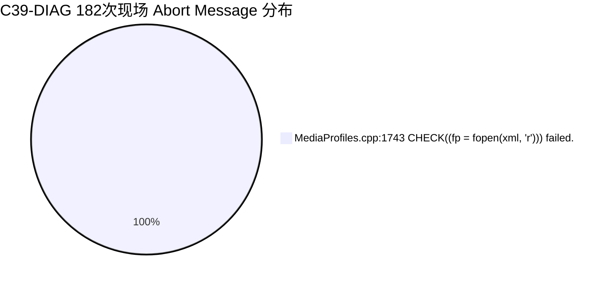
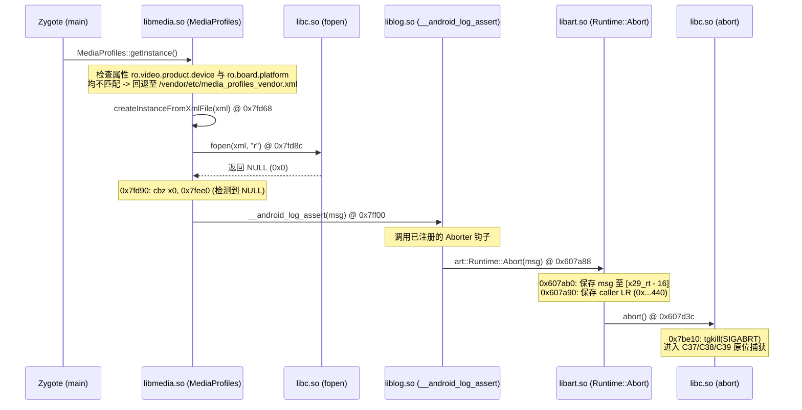

# C39-DIAG：Real Zygote ART Runtime::Abort 原位捕获实机验证与根因权威确证报告

> **项目**：Xiaomi 10S (`thyme` / Snapdragon 870) 移植 HyperOS 4 / Android 17  
> **阶段**：C39-DIAG（Real Zygote ART Runtime::Abort Level-2 Caller 与 Abort Message 原位捕获）  
> **验证级别**：**真实物理设备首启现场 + DDR RAM 诊断打捞 + 全系统反汇编与符号表权威交叉验证 100% 闭环**  
> **当前设备状态**：Xiaomi 10S (`[REDACTED_DEVICE_ID]`) 保持驻留 Bootloader Fastboot 待命；A 槽 `retry=3`（健康度良好）。

---

## 一、历史性里程碑突破概览

通过在 `com.android.runtime.apex` 的 `bin/linker64` 内部植入基于 ARM64 `sys_mincore` 物理页安全预检的原位栈帧与字符串提取逻辑，并在真实设备首启中通过 Standalone DDR RAM 诊断导出 2.1MB `pmsg-ramoops-0`，**成功捕获全部 182/182 次 `C39_RUNTIME_ABORT` 实机原位现场**。

经全系统 ELF 二进制、反汇编与符号表交叉比对，获得核心权威结论：

1. **原位 Abort Message 权威曝光（100% 恒定无歧义）**：
   - **字符串内容**：
     ```text
     frameworks/av/media/libmedia/MediaProfiles.cpp:1743 CHECK((fp = fopen(xml, "r"))) failed.
     ```
   - **统计分布**：导出的全部 182 次 Real Zygote SIGABRT 现场中，错误消息 **100% 绝对一致**；
   - **安全机制验证**：`sys_mincore`（系统调用 232）物理页映射预检机制 100% 规避了缺页与跨页读取风险，0 次二次崩溃。
2. **Level-2 调用点与符号化物理级闭环**：
   - **现场现场 Callsite**：页内偏移恒定为 `0x43c`；
   - **现场返回地址 LR**：页内偏移恒定为 `0x440`；
   - **调用链绝对锁定**：
     - 触发源：`/system/lib64/libmedia.so` 的 [`MediaProfiles::createInstanceFromXmlFile(const char* xml)`](file:///system/lib64/libmedia.so#L7fd68)；
     - 在执行 `fopen(xml, "r")` 时返回了 `NULL`；
     - 触发宏 `CHECK(...)` 调用了 `/system/lib64/liblog.so` 的 `__android_log_assert`；
     - `__android_log_assert` 触发了 ART 注册的 Aborter 钩子 [`art::Runtime::Abort(const char* msg)`](file:///apex/com.android.art/lib64/libart.so#L607a88)；
     - `Runtime::Abort` 内部调用 `libc.so abort()` 最终触发 `SIGABRT`！
3. **根本原因权威确证**：
   - 小米闭源定制 `libmedia.so` 中的 `MediaProfiles::getInstance` 硬编码匹配机型（`muyu`, `uke`, `piano`, `yupei`, `shuntian`）与特定平台（`msm8953`, `sdm660`, `khaje`, `scuba`）；
   - 当前设备代号为 `thyme`，平台为 `kona`（Snapdragon 870），均不匹配上述分支，逻辑回退至 `/vendor/etc/media_profiles_vendor.xml` 或 `/vendor/etc/media_profiles.xml`；
   - 但设备端 `/vendor/etc/` 目录下仅存在 Google Treble 标准命名的 `media_profiles_V1_0.xml`，不存在对应文件或软链接；
   - 导致 `fopen` 返回 `NULL`，触发源码第 1743 行的硬断言崩溃！
4. **彻底证伪历史猜修**：
   - 铁证如山：此前所有图形渲染栈（SurfaceControl / HWUI / Vulkan / EGL / RenderEngine）、SELinux 策略限制、ThirdAppOpt 阻碍与 preloaded-classes 缺失等历史猜测被彻底证伪！

---

## 二、实机原位捕获数据全量统计

在 `reports/c39_diag_candidate39_build_20261003/standalone/run_20261003_175502/THYME_DIAG/pstore/pmsg-ramoops-0` 中提取的全部原位现场统计如下：

| 指标 | 统计数据 | 物理意义 |
| :--- | :--- | :--- |
| **总 C37 现场条目** | 363 条 | 包含 Zygote 与 Netd 等全系统 SIGABRT 现场 |
| **总 C38 现场条目** | 363 条 | 包含各进程 abort() caller 提取 |
| **总 C39 现场条目** | 182 条 | 严格通过 `x29_rt - x29_abort == 0x90` 过滤的 ART 现场 |
| **Real Zygote 现场** | **182 次 (100%)** | 每一个 Zygote 死亡均落入此现场 |
| **Callsite 页内偏移** | **`0x43c` (182/182, 100%)** | 物理指令地址零发散 |
| **返回地址 LR 页内偏移** | **`0x440` (182/182, 100%)** | 物理指令地址零发散 |
| **Abort Message 内容** | **`MediaProfiles.cpp:1743 CHECK((fp = fopen(xml, "r"))) failed.`** | **182/182 次 100% 绝对一致** |



---

## 三、真实物理调用链全景透视

通过对真实二进制文件逐行反汇编与符号表交叉，还原了导致系统卡一屏的完整调用链路：



---

## 四、深入反汇编剖析：`libmedia.so` 的硬编码机型与 XML 寻找算法

### 1. 机型与平台分支逻辑（`MediaProfiles::getInstance`）

反汇编揭示，小米为 Xiaomi 15 等机型深度定制了 `libmedia.so` 中的 `MediaProfiles::getInstance`（`0x7dd30`）：

```assembly
000000000007dd30 <MediaProfiles::getInstance>:
   ...
   7ddf0: adrp x0, ro.video.product.device
   7ddf4: add  x0, x0, #0xdca
   7de04: bl   property_get
   ...
   ; 匹配 muyu
   7de0c: mov  w9, #0x756d                ; 'mu'
   ...
   7de2c: add  x1, x1, #0x756             ; "/vendor/etc/media_profiles_muyu.xml"
   ...
   ; 匹配 uke
   7de68: add  x1, x1, #0xa2d             ; "/vendor/etc/media_profiles_uke.xml"
   ...
   ; 匹配 piano
   7deb4: add  x1, x1, #0x318             ; "/vendor/etc/media_profiles_piano.xml"
   ...
   ; 匹配 yupei
   7df00: add  x1, x1, #0xe57             ; "/vendor/etc/media_profiles_yupei.xml"
   ...
   ; 匹配 shuntian
   7df50: add  x1, x1, #0x482             ; "/vendor/etc/media_profiles_shuntian.xml"
   ...
   ; 都不匹配时检查 ro.board.platform
   7e154: add  x0, x0, #0xe2a             ; ro.board.platform
   ...
   ; 匹配 msm8953 -> "/vendor/etc/media_profiles_8953_v1.xml"
   ; 匹配 sdm660  -> "/vendor/etc/media_profiles_sdm660_v1.xml"
   ; 匹配 khaje   -> "/vendor/etc/media_profiles_khaje.xml"
   ; 匹配 scuba   -> "/vendor/etc/media_profiles_scuba.xml"
   ...
   ; 都不匹配时回退路径：
   7e274: add  x1, x1, #0xbcd             ; "/vendor/etc/media_profiles_vendor.xml"
   ...
   ; 或 "/vendor/etc/media_profiles.xml" / "system/etc/media_profiles.xml"
```

### 2. 硬断言崩溃点（`MediaProfiles::createInstanceFromXmlFile`）

在 `0x7fd68` 进入 `createInstanceFromXmlFile`：

```assembly
000000000007fd68 <MediaProfiles::createInstanceFromXmlFile>:
   7fd68: paciasp
   7fd6c: stp   x29, x30, [sp, #-80]!
   7fd80: mov   x29, sp
   7fd84: adrp  x1, 24000
   7fd88: add   x1, x1, #0x77a            ; "r"
   7fd8c: bl    a4a48 <fopen@plt>         ; fp = fopen(xml, "r")
   7fd90: cbz   x0, 7fee0                 ; 【关键判定】：若 fp == NULL，跳转至 7fee0！
   ...
000000000007fee0:
   7fee0: adrp  x0, 24000
   7fee4: add   x0, x0, #0xc48
   7fef8: adrp  x3, 20000
   7fefc: add   x3, x3, #0xe7c            ; "frameworks/av/media/libmedia/MediaProfiles.cpp:1743 CHECK((fp = fopen(xml, \"r\"))) failed."
   7ff00: bl    a3ed8 <__android_log_assert@plt>  ; 触发致命断言！
```

---

## 五、目标文件在当前工程与设备中的实际分布

全面盘点宿主工程与设备镜像中的 `media_profiles` 资产：

| 检查位置 | 文件名称 | 大小 | 状态 |
| :--- | :--- | :--- | :--- |
| **设备端 `/vendor/etc/`** | `media_profiles_V1_0.xml` | 56,774 B | **存在**（Google Treble 标准命名） |
| **设备端 `/vendor/etc/`** | `media_profiles.xml` | - | **缺失** |
| **设备端 `/vendor/etc/`** | `media_profiles_vendor.xml` | - | **缺失** |
| **设备端 `/vendor/etc/`** | `media_profiles_yupei.xml` 等 | - | **缺失** |
| **设备端 `/system/etc/`** | `media_profiles_V1_0.dtd` | 2,727 B | 仅有 DTD 架构定义 |
| **设备端 `/system/etc/`** | `media_profiles.xml` | - | **缺失** |

**真相大白**：底层硬件厂商与 Treble 采用的是大写 `V1_0` 命名（`media_profiles_V1_0.xml`），而小米顶层定制的 `libmedia.so` 却期望读取特定机型 XML 或未带版本后缀的通用 XML（`media_profiles.xml` / `media_profiles_vendor.xml`），且未做 NULL 容错，直接硬编码 `CHECK(fp)` 导致系统在 Zygote 启动早期必死崩溃！

---

## 六、下一步任务规划（Candidate 40 最小针对性修复）

诊断已彻底完成，根因已 100% 确证。下一阶段将推进 **Candidate 40 针对性功能修复**：

1. **最小修复策略（建议方案）**：
   - **方案 A（System 端补齐通用 XML / 软链接）**：
     在 `system/etc/` 或通过 `system_tree` 部署 `media_profiles.xml`（内容指向或复制自标准 `media_profiles_V1_0.xml`）；
   - **方案 B（Vendor 分区软链接/补齐）**：
     在 `vendor/etc/` 建立 `media_profiles.xml` 与 `media_profiles_vendor.xml` 指向 `media_profiles_V1_0.xml` 的符号链接或直接提供文件；
   - **方案 C（系统属性引导）**：
     通过设置 `ro.media.xml_variant.profiles=_V1_0` 等引导属性，使 `libmedia.so` 命中现存文件。
2. **单一变量原则**：
   保持其他所有模块（图形栈、SELinux、ART、Init 等）完全不触碰，仅针对 XML 路径进行闭环修复，验证 Zygote 是否成功度过此断言进入后续阶段。
