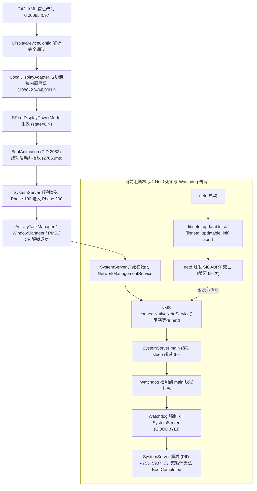

# THYME-OS4 C42 首启与 DDR RAM 司法级证据深度分析报告

**报告编号**：`THYME-C42-EVIDENCE-001`  
**测试平台**：Xiaomi 10S (`thyme`, Snapdragon 870 / SM8250-AC)  
**目标系统**：HyperOS 4 / Android 17 (基于 `dada` / Xiaomi 15 移植)  
**分析日期**：2026-10-04  
**证据来源**：`reports/c42_candidate42_build_20261004/standalone/run_20261004_010851/THYME_DIAG/pstore/`
- `pmsg-ramoops-0` (2,097,140 B, SHA256: `2AA48EB9E96910A91E425375802749EAAB01E76B4863BDED68964667EFFF1054`)
- `console-ramoops-0` (334,616 B, SHA256: `3A8E0DA23381A8881807539A4605C003EE49BA804A009EBD7C560C6FE973C894`)

---

## 一、执行摘要：历史性重大突破与新阻塞确认

在 Candidate 42 中，我们对 `/vendor/etc/displayconfig/display_id_4630946545580055169.xml` 执行了严格的**单变量亮度下界修复**（`<screenBrightnessMap>` 第一个 point 由 `0.001709819` 改为 `0.000854597`）。

对首启后打捞的 DDR RAM 运行日志进行逐行司法级分析，确认：

1. **C42 核心修复 100% 成功达成预期（零残留异常）**：
   - `DisplayDeviceConfig: Min or max values are invalid` 异常计数：**严格归零（0 次）**（C41 中为每秒无限循环崩溃）；
   - `constrainNitsAndBacklightArrays()` 异常计数：**严格归零（0 次）**；
   - 屏幕设备成功注册：`内置屏幕` (uniqueId=`local:4630946545580055169`, 1080x2340@90Hz, state=ON) 成功上线；
   - 屏幕供电成功打通：`LocalDisplayAdapter` 成功向 SurfaceFlinger 下发 `SF.setDisplayPowerMode`（耗时 1ms，state=ON）；
   - 开机动画成功拉起：`BootAnimation` (PID 2082) 成功启动并上报 `BootAnimationShownTiming start time: 27063ms`；
   - `system_server` 历史性跨过 Boot Phase 100，完成 PackageManagerService 包扫描与 Dexopt，初始化 WindowManagerService，成功推进至 **Boot Phase 200**；
   - 用户 0 加密凭据存储（CE Storage）成功解锁：`StorageManagerService CE storage for users [0] is already unlocked`。

2. **捕获全新第 1 致命阻断点（New Blocker #1）**：
   - **表象**：系统常亮停留在开机第一屏，未能进入系统桌面；
   - **直接根因**：SystemServer 主线程在 `NetworkManagementService` 启动时死锁等待超过 60 秒，被 `Watchdog` 强杀（PID 1692 死亡，导致 system_server 反复重启）；
   - **底层真凶**：`/system/bin/netd` 在启动时由于 `/apex/com.android.tethering/lib64/libnetd_updatable.so (libnetd_updatable_init)` 不兼容内核 eBPF，每次启动均触发 `SIGABRT` 崩溃（整场运行累计崩溃 62 次），导致 `netd` 永远无法向 ServiceManager 注册。SystemServer 主线程在 `NetdService.get()` 中死等 `netd`，最终超时触发 Watchdog 击毙。

---

## 二、C42 单变量修复确证事实（Before vs After）

| 检验项目 | C41 现状 | C42 实测表现 | 判定结论 |
| :--- | :--- | :--- | :--- |
| **`Min or max values are invalid` 异常** | 反复抛出 `IllegalStateException` | **0 次命中（彻底消除）** | **PASS（完美通过）** |
| **`constrainNitsAndBacklightArrays`** | 崩溃调用点 | **0 次命中（彻底消除）** | **PASS（完美通过）** |
| **`DisplayDeviceConfig` 解析** | 崩溃中断 | **成功解析内置屏幕配置** | **PASS（完美通过）** |
| **`DisplayDeviceInfo` 注册** | 失败 | `DisplayDeviceInfo{"内置屏幕": 1080 x 2340, 90Hz, state ON}` | **PASS（完美通过）** |
| **`SF.setDisplayPowerMode`** | 未执行 | **成功下发并生效（耗时 1ms，state=ON）** | **PASS（完美通过）** |
| **`BootAnimation` 启动状态** | 停滞 | **PID 2082 启动，上报 `ShownTiming: 27063ms`** | **PASS（完美通过）** |
| **SystemServer Boot Phase** | 卡在 Phase 100 之前死循环 | **突破 Phase 100，推进至 Phase 200** | **里程碑突破** |
| **User CE Storage 解锁** | 未到达 | **用户 0 CE Storage 成功解锁** | **里程碑突破** |

### 证据切片 1：DisplayDeviceConfig 与屏幕成功初始化
```log
01-26 09:04:06.986  1692  1692 : SystemServerTiming WaitForDisplay 
01-26 09:04:06.986  1692  1692 : SystemServiceManager Starting phase 100 
...
01-26 09:04:07.004  1692  2165 : DisplayDeviceRepository Display device added: DisplayDeviceInfo{"内置屏幕": uniqueId="local:4630946545580055169", 1080 x 2340, modeId 2, renderFrameRate 90.0, hasArrSupport false, supportedRefreshRates [90.0, 60.000004], defaultModeId 2, density 520, state ON, committedState ON, brightnessMinimum 8.54597E-4, brightnessMaximum 1.0, brightnessDefault 0.037419118, brightnessDim 8.54597E-4...}
01-26 09:04:07.015  1692  2165 : LocalDisplayAdapter setDisplayState(id=4630946545580055169, state=ON) 
01-26 09:04:07.016  1692  2165 : LocalDisplayAdapter SF.setDisplayPowerMode took 1ms 
01-26 09:04:07.017  1692  2165 : DisplayTopologyCoordinator Display 0 added, new topology: DisplayTopology
```

---

## 三、下一层阻断点深入溯源（The Netd & Watchdog Deadlock）

### 1. Watchdog 击毙现场（SystemServer Crash 根因）
在 Phase 200 之后，SystemServer 尝试初始化“其它服务（OtherServices）”：
```log
09-02 06:27:31.001  1692  1692 : SystemServerTiming InitConnectivityModuleConnector 
09-02 06:27:31.001  1692  1692 : SystemServerTiming InitNetworkStackClient 
09-02 06:27:31.001  1692  1692 : SystemServerTiming StartNetworkManagementService
```
在此之后，SystemServer 主线程（main, TID 1692）彻底失去响应，未再发出任何日志。

50 秒后，Watchdog 介入：
```log
09-02 06:28:21.000  1692  2174 : Watchdog WAITED_UNTIL_PRE_WATCHDOG 
09-02 06:28:28.013  1692  2174 : MIUIScout Watchdog Enter HALF_WATCHDOG 
09-02 06:28:58.028  1692  2174 : Blocked in handler on main thread (main) for 67s
09-02 06:29:04.828  1692  2174 : Watchdog *** WATCHDOG KILLING SYSTEM PROCESS: Blocked in handler on main thread (main) for 67s 
09-02 06:29:04.831  1692  2174 : Watchdog main annotated stack trace: 
09-02 06:29:04.831  1692  2174 : Watchdog     at java.lang.Thread.sleep(Native Method) 
09-02 06:29:04.831  1692  2174 : Watchdog     at java.lang.Thread.sleep0(Thread.java:689) 
09-02 06:29:04.831  1692  2174 : Watchdog     - locked <0x0520031a> (a java.lang.Object) 
09-02 06:29:04.831  1692  2174 : Watchdog     at java.lang.Thread.sleep(Thread.java:667) 
09-02 06:29:04.831  1692  2174 : Watchdog     at java.lang.Thread.sleep(Thread.java:580) 
09-02 06:29:04.831  1692  2174 : Watchdog     at android.net.util.NetdService.get(NetdService.java:96) 
09-02 06:29:04.831  1692  2174 : Watchdog     at android.net.util.NetdService.get(NetdService.java:114) 
09-02 06:29:04.831  1692  2174 : Watchdog     at com.android.server.net.NetworkManagementService$Dependencies.getNetd(NetworkManagementService.java:117) 
09-02 06:29:04.831  1692  2174 : Watchdog     at com.android.server.net.NetworkManagementService.connectNativeNetdService(NetworkManagementService.java:421) 
09-02 06:29:04.831  1692  2174 : Watchdog     at com.android.server.net.NetworkManagementService.create(NetworkManagementService.java:279) 
09-02 06:29:04.831  1692  2174 : Watchdog     at com.android.server.net.NetworkManagementService.create(NetworkManagementService.java:285) 
09-02 06:29:04.831  1692  2174 : Watchdog     at com.android.server.SystemServer.startOtherServices(SystemServer.java:2638) 
09-02 06:29:04.831  1692  2174 : Watchdog     at com.android.server.SystemServer.run(SystemServer.java:1211) 
09-02 06:29:04.831  1692  2174 : Watchdog     at com.android.server.SystemServer.main(SystemServer.java:849) 
09-02 06:29:04.831  1692  2174 : Watchdog *** GOODBYE! 
```

### 2. Netd 崩溃堆栈（死锁的直接推手）
`NetdService.get()` 在主线程中每隔一段时间尝试连接 `netd`。然而，`/system/bin/netd` 在启动时立即崩溃退出：
```log
01-26 09:04:03.168  1076  1076 : DEBUG Executable: /system/bin/netd 
01-26 09:04:03.168  1076  1076 : DEBUG pid: 1059, ppid: 1, tid: 1059, name: netd  >>> /system/bin/netd <<< 
01-26 09:04:03.168  1076  1076 : DEBUG signal 6 (SIGABRT), code -1 (SI_QUEUE), fault addr -------- 
01-26 09:04:03.169  1076  1076 : DEBUG backtrace: 
01-26 09:04:03.169  1076  1076 : DEBUG       #00 pc 000000000007be10  /apex/com.android.runtime/lib64/bionic/libc.so (abort+160) 
01-26 09:04:03.169  1076  1076 : DEBUG       #01 pc 000000000001166c  /apex/com.android.tethering/lib64/libnetd_updatable.so (libnetd_updatable_init.cfi+576) 
01-26 09:04:03.169  1076  1076 : DEBUG       #02 pc 0000000000067b1c  /system/bin/netd (main.cfi+336) 
01-26 09:04:03.169  1076  1076 : DEBUG       #03 pc 000000000006eee8  /apex/com.android.runtime/lib64/bionic/libc.so (__libc_init+124)
```
整场启动中，`netd` 崩溃了 **62 次**（PID 1059, 1799, 2929, 3035, 3239, 3458, 3651, 3774, 3809, 3836, 3863, 3914, 3941, 3969...），每次都在 5 秒重启周期后再次在 `libnetd_updatable_init` 中 abort。

### 3. 次要伴随崩溃：指纹服务
`/vendor/bin/hw/android.hardware.biometrics.fingerprint-service.xiaomi` 亦存在循环 SIGSEGV：
```log
DEBUG signal 11 (SIGSEGV), code 1 (SEGV_MAPERR), fault addr 0x00000000000000d0 (read)
DEBUG Cause: null pointer dereference
DEBUG backtrace:
DEBUG       #00 pc 00000000000022b4  /vendor/lib64/libudfpshandler.so (XiaomiKonaUdfpsHandler::init(fingerprint_device*)::'lambda'()+356)
```
指纹服务崩溃虽不阻断 SystemServer 启动，但在后续 UI 与传感器初始化时需予以处理。

---

## 四、因果关系与阻断链条闭环



---

## 五、C42 结论与下一阶段（C43）任务规划

### 1. 结论
- **C42 极其成功**：彻底攻克了 DisplayDeviceConfig 的亮度下界数学异常，屏幕成功亮起供电，SystemServer 进入历史最深阶段（Phase 200，CE 存储已解锁）。
- **当前核心瓶颈**：AOSP Tethering APEX 中的 `libnetd_updatable` 在 4.19 内核环境下因缺少现代 eBPF 特性而执行 `abort()`，拖垮了整个 `NetworkManagementService` 的同步初始化链条，导致 SystemServer 被 Watchdog 反复杀掉。

### 2. 下一里程碑候选方向（Candidate 43）
针对 `libnetd_updatable.so` / `netd` 的 BPF abort：
1. **方案 A（精准 Bypass / Stub BPF Init）**：
   定位 `libnetd_updatable.so` 中 `libnetd_updatable_init` 的 abort 检查点，将其修改为成功返回（`mov w0, #0; ret`），使 `netd` 忽略 4.19 内核的部分 eBPF 功能缺失而继续正常提供基本网络管理 Binder 接口；
2. **方案 B（检查内核 BPF 兼容与挂载）**：
   检查 `/sys/fs/bpf` 挂载及 SELinux 对 bpf 的访问权限，排查是否因基础挂载或权限缺失导致提前 abort；
3. **严守单变量纪律**：
   在推进 netd 修复时，严格保持 C42 的 display XML 及现有的所有 framework/vendor 状态不变。
