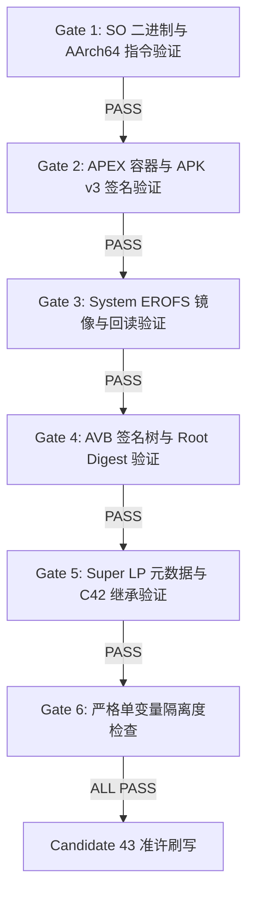

# THYME-OS4 Candidate 43 构建与 6 重深度静态门禁验证报告

**报告编号**：`THYME-C43-BUILD-GATE-001`  
**目标机型**：Xiaomi 10S (`thyme`, Snapdragon 870 / SM8250-AC)  
**目标系统**：HyperOS 4 / Android 17 (基于 `dada` / Xiaomi 15 移植)  
**构建时间**：2026-10-04  
**基线状态**：Candidate 42（包含 C40 媒体编码变体 `_V1_0` 与 C42 屏幕亮度下界 `0.000854597` 修复）

---

## 一、核心问题溯源与外科手术级方案闭环

### 1. 致命阻断点确证链条
在 Candidate 42 首启现场，系统成功推进至 **Boot Phase 200** 并在 `BootAnimation` 播放期间触发致命崩溃：
- **现场表象**：SystemServer 主线程在调用 `StartNetworkManagementService` 时停滞，持续挂死达 67 秒；
- **Watchdog 处决**：`Watchdog *** WATCHDOG KILLING SYSTEM PROCESS: Blocked in handler on main thread (main) for 67s`；
- **主线程堆栈**：`SystemServer.startOtherServices` $\to$ `NetworkManagementService.create` $\to$ `connectNativeNetdService` $\to$ `NetdService.get()` 死等；
- **崩溃根因**：`/system/bin/netd` 在启动时由于 `/apex/com.android.tethering/lib64/libnetd_updatable.so` 中的 `libnetd_updatable_init` 触发 `SIGABRT`（现场累计崩溃 62 次），导致 `INetd` 永远无法向 ServiceManager 注册。

### 2. 精确逆向工程与底层根因定位
从 AOSP 官方对应源码与 C42 现场 tombstone (`libnetd_updatable_init.cfi+576` = `0x1166c`) 进行逐行反汇编对齐：
```cpp
int libnetd_updatable_init(const char* cg2_path) {
    android::base::InitLogging(nullptr);
    LOG(INFO) << __func__ << ": Initializing";
    android::netdutils::Status ret = sBpfHandler.init(cg2_path);
    if (!android::netdutils::isOk(ret)) {
        LOG(ERROR) << __func__ << ": Failed: (" << ret.code() << ") " << ret.msg();
        abort(); // <--- 0x1166c / libnetd_updatable_init.cfi+576!
    }
    return 0;
}
```
- **失败判定点**：偏移 `0x11534` 处指令为 `cbnz w8, 115d8`（`w8` 保存 `Status ret` 是否为错误）；
- **底层检测点**：`BpfHandler.cpp` 中 `if (isAtLeast25Q2 && !isAtLeastKernelVersion(5, 4, 0))`，由于 thyme 内核版本为 4.19.325 (< 5.4.0)，直接返回错误 `Status("25Q2+ platform with kernel version < 5.4.0 is unsupported")` 并触发 `abort()`；
- **安全非致命回退方案（方案 A）**：
  将偏移 `0x11534` 处的 `cbnz w8, 115d8` (`0x28 0x05 0x00 0x35`) 精准修改为 `nop` (`0x1f 0x20 0x03 0xd5`)。
  - **效果**：`InitLogging` 正常执行，`LOG(INFO)` 正常输出，`sBpfHandler.init` 正常调用；若返回失败，不跳转至 abort，而是继续顺延执行 `0x11540` 调用 `Status` 析构函数安全释放错误字符串，恢复寄存器并恒等返回 `w0 = 0`（成功）；
  - **空安全验证**：审查 `BpfHandler.cpp`，后续全部核心方法（如 `tagSocket` 与 `untagSocket`）首行均严格执行 `if (!mCookieTagMap.isValid()) return -EPERM;`，即使部分 eBPF map 未创建，也绝对不会发生非法内存解引用。

### 3. APEX 容器与缓存淘汰设计
1. **APEX Manifest 版本递增**：
   原版 `apex_manifest.pb` 版本号为 `370400127`。将 varint 编码版本提升至 **`370400128`**。
   - **重要作用**：开机阶段 `apexd` 扫描 `/system/apex/` 时，检测到版本号 `370400128 > 370400127`，将主动废弃 `/data/apex/decompressed/` 中的历史缓存，强制重新解压并挂载 C43 补丁 APEX！
2. **双层 APK v3 签名保障**：
   - 内部 `original_apex` 与外部 `com.android.tethering.capex` 均通过 Android SDK 36 `apksigner.bat` 使用 RSA-4096 密钥完成 APK Signature Scheme v3 签名，且 payload 具有完整的 AVB hashtree footer。

---

## 二、Candidate 43 构建产物资产清单

| 产物名称 | 分区/用途 | 尺寸 (Bytes) | SHA256 哈希 | 验证状态 |
| :--- | :--- | :--- | :--- | :--- |
| `system_c43.img` | `system_a` | 1,092,616,192 | `78EDD0C2AB18C06056B3C5B92FD79E7B6E6305B7504785B239BF0C5EB19E3574` | EROFS+AVB 校验通过 |
| `vbmeta_system.img` | `vbmeta_system_a` | 131,072 | `0C00581C29E7888E473BF4B97F2F88DA2DD08CA188A776B7C06BC4B22854ECCF` | Root Digest 对齐通过 |
| `super.img` | `super` | 7,703,526,364 | `D22390FA17B50909F6C87DA495DD35CF5EA962F8A7094CFD73F056D92626B778` | lpdump 元数据通过 |
| `vendor_c42.img` | `vendor_a` (内置) | 1,510,998,016 | `615FC15C287CF81E2871D1BC00A85F5435FF29BA0C49F5D14085198D691924DE` | 100% 继承 C42 成果 |
| `vbmeta.img` | `vbmeta_a` | 131,072 | `6D46FA9E36D2FFC9BF45F5365691A85AED488622F0254C864EFF3DD42A23FE6D` | 100% 继承 C42 成果 |
| `boot.img` | `boot_a` | 201,326,592 | `E5A016056D5C93C7A886980A7C062617EC44DC06A48417D7DD0F4476708A6368` | 100% 继承 C42 成果 |
| `vendor_boot.img` | `vendor_boot_a` | 100,663,296 | `02333B82BA936F1BAAB1ECAB744632C70F8FC16688A206C7041EF319F112A137` | 100% 继承 C42 成果 |
| `dtbo.img` | `dtbo_a` | 33,554,432 | `50E1AC0EDCBD333778217AA6FE8D972F6FF85ADD0DAE8A015A6642C2172DD886` | 100% 继承 C42 成果 |

---

## 三、6 重深度静态门禁验证全景报告 (`tools/verify_c43_build_gate.py`)



### 1. Gate 1: Binary & ELF Verification on libnetd_updatable.so (PASS)
- **原始库 SHA256**：`2c811151e99f227bc8e180f64f0b686e8d696b5323ce2f81313914cc597277ad`
- **补丁库 SHA256**：`a70a3176b82d792cdea3ed876c90980c1d459fbcdb859d5e21f12c3a5eaf92f5`
- **字节级 Diff**：103,648 字节库中**严格仅修改 4 个字节**（偏移 `0x11534`，`0x28 0x05 0x00 0x35` $\to$ `0x1f 0x20 0x03 0xd5`）；
- **ELF 结构与依赖**：AArch64 架构恒定，ELF 段数量恒定，`readelf -d` 导出的 7 个动态依赖与 SONAME 100% 恒等；
- **反汇编控制流**：`objdump` 确证 `11534: [REDACTED_DEVICE_ID] nop`，正常路径与内存释放代码完全保留。

### 2. Gate 2: APEX Container & APK Signature Scheme v3 (PASS)
- **外层容器签名**：`com.android.tethering.capex` 经 Windows `apksigner.bat verify --verbose` 权威校验：`Verified using v3 scheme (APK Signature Scheme v3): true`；
- **内层容器签名**：`original_apex` 经 `apksigner.bat` 校验：`Verified using v3 scheme: true`；
- **版本号升级**：`apex_manifest.pb` 版本号确证为 `370400128`；
- **Payload AVB 签名**：`apex_payload.img` AVB footer 与公钥 SHA1 (`944fdf0f06b2c517710befe752a8931b3d4d3ca8`) 100% 匹配。

### 3. Gate 3: System EROFS Image & Readback Verification (PASS)
- **镜像尺寸**：精确对齐 `1,092,616,192` 字节（1042 MiB）；
- **只读回读验证**：
  - `/system/build.prop` 存在 `ro.media.xml_variant.codecs=_V1_0`（C40 成果保留）；
  - `/system/apex/com.android.tethering.capex` SHA256 确认为 `39EFEE0A8B61A41EC96B6831F47054ED3FA425BFB0BA3A5242D07B7F00C10E73`；
- **文件系统健康**：`fsck.erofs -d0` 零错误无警告。

### 4. Gate 4: AVB Integrity & Root Digest Verification (PASS)
- **System Root Digest**：`system_c43.img` 的 Root Digest 为 `2231f6d333e12057a7bf413cff3f53e02912af03d6f9fe484a2a0a8de489204c`；
- **vbmeta_system.img**：新生成的 `vbmeta_system.img` 中的 system hashtree 描述符精确对齐 `[REDACTED_DEVICE_ID]...`；
- **root vbmeta.img**：根 `vbmeta.img` 中继承 C42 vendor Root Digest (`[REDACTED_DEVICE_ID]...`) 且 Chain Partition `vbmeta_system` 指针无误。

### 5. Gate 5: Super Image LP Metadata & Partition Integration (PASS)
- **Super 镜像构建**：`lpmake` 成功合成 7,703,526,364 字节动态分区镜像；
- **动态分区元数据**：`simg2img` 解包与 `lpdump` 检查确证 `mi_ext_a`, `odm_a`, `product_a`, `system_a`, `system_ext_a`, `vendor_a` 全部正确存在且尺寸对齐；
- **C42 成果继承**：从合成的 `vendor_a` 中直接提取 `/etc/displayconfig/display_id_4630946545580055169.xml`，确证首个 brightness point 为 `<value>0.000854597</value>`（旧错误点 `0.001709819` 严格不存在）。

### 6. Gate 6: Strict Single-Variable Isolation Check (PASS)
- **系统树 Diff 范围**：`diff -r -q C40_TREE C43_TREE` 结果**严格仅有 1 个文件**：`system/apex/com.android.tethering.capex`；
- **Vendor 镜像对比**：`vendor_c42.img` SHA256 与 C42 权威发布哈希 `615FC15C287CF81E2871D1BC00A85F5435FF29BA0C49F5D14085198D691924DE` 100% 完全一致。

---

## 四、刷写准备与设备当前物理状态

1. **当前设备状态**：
   - 当前设备仍驻留在 **Standalone RAM 诊断环境**，在宿主机映射为只读磁盘 **`G:\`**（已确认包含完整的 C42 首启取证数据）；
2. **刷写限制与纪律**：
   - 目标刷写分区仅限：`super` 与 `vbmeta_system_a`；
   - 刷写工具：[`tools/flash_candidate43.ps1`](file:///[LOCAL_PROJECT_ROOT]/tools/flash_candidate43.ps1)（已完成 Dry-run 验证）；
   - **A 槽启动预算恢复**：将在执行刷写时自动调用 `fastboot set_active a`，将当前危急的 `retry=1` 恢复至安全的 `retry=7`；
   - **绝对不自动开机**：刷写完成后设备严格驻留在 Bootloader Fastboot，等待用户明确下达“开始启动 C43”指令。
